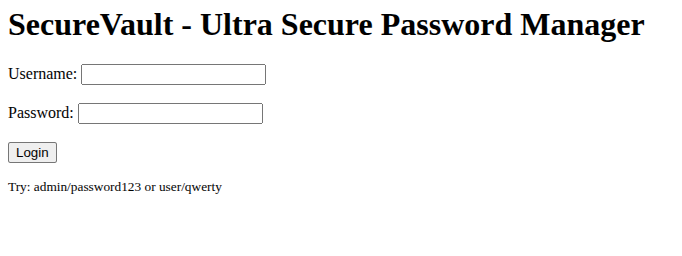
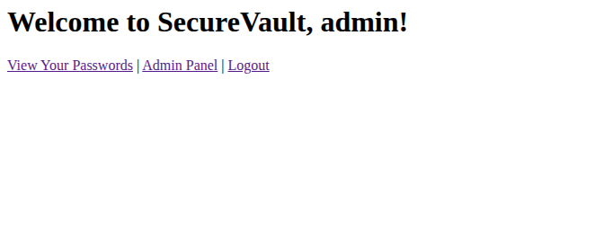
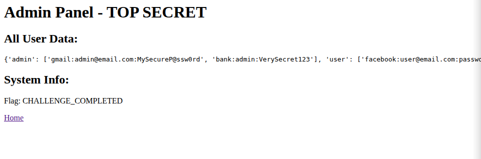
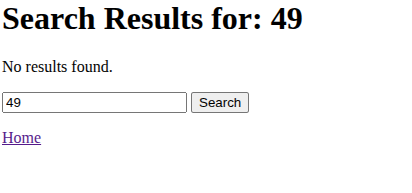
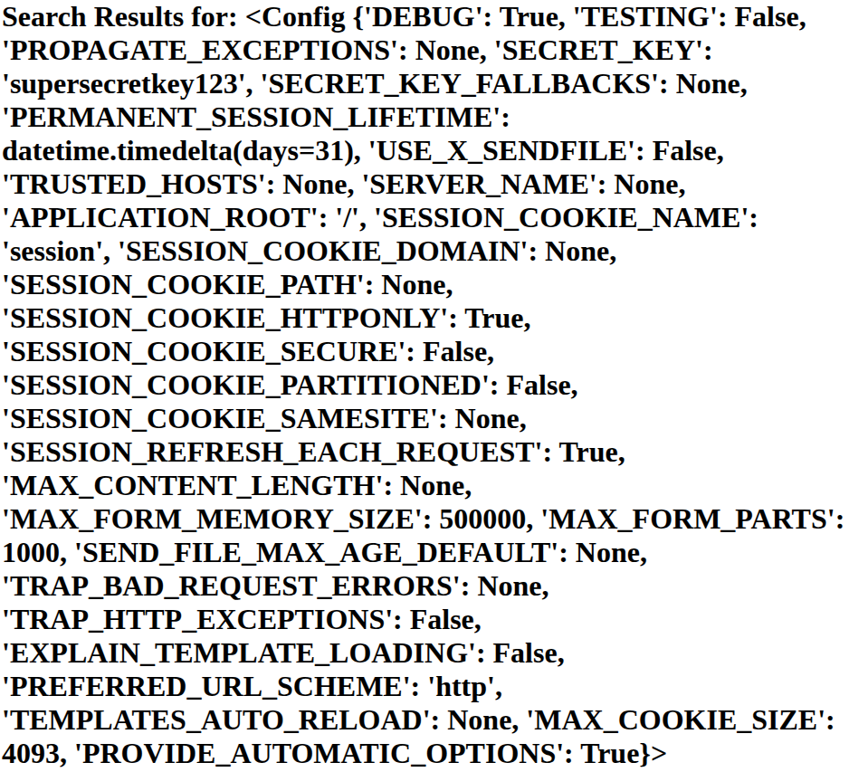
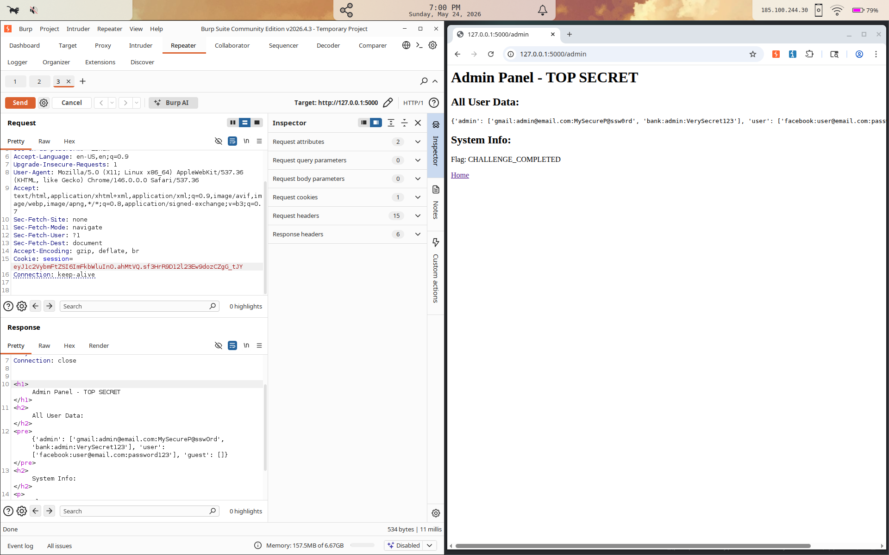

# SecureVault Challenge

## Summary

SecureVault is a Flask-based password manager with multiple vulnerabilities.

### Mission brief:
> *'You've been hired as a security consultant to test a new password manager called "SecureVault". The junior developer who built it claims it's "totally secure", but you suspect otherwise. Your job is to find the vulnerabilities and fix them!'*
> 

## What this is
This is not a typical pentest report, It's my learning journey. This is my documentation on what I've learned, what I did right, what I did wrong and the things I had to look up and learn more about.

## Attacking
### The given hints:  

> Session Cookies: Check your browser's developer tools

> Template Injection: Flask   templates can execute Python expressions

> Authentication: Sometimes the simplest approach works

> Admin Check: Is there more than one way to become "admin"?

### Step 1 - Examination

Right after running the app, this came up on my screen:  
  
  
  
Logging in as admin gave me multiple tabs:
* 	View your passwords
* 	Admin panel
* 	Logout



The "View your passwords" section showed a gmail and a bank account, but the Admin panel had something interesting.  
  
 
  
An all user data section, but its formated in a weird way.

After that, I logged in with the normal user account. Everything was as expected, the admin panel was forbidden.

The hint said something about session cookies, so I thought this was the right moment to learn Burp Suite.  

### Step 2 - Intercepting /w Burp Suite


After running Burp, I logged in as a normal user and turned intercepting on. I catched the session and found the cookie. After decoding the cookie (base64), I found that the first part was  
```bash
{"username":"user"}
```


Because this is the first time I tampered with a Flask app, I had to research more about Flask cookies.  
  
The session is made up from 3 parts:
1. Payload
2. Timestamp
3. Signature

The payload is a simple base64 encoded JSON. In this case, it just sees what's the username of the currently logged in user.

The timestamp is when the cookie was made

Signature is the [HMAC](https://en.wikipedia.org/wiki/HMAC) of the payload + timestamp thats mathematically computed using the Secret key.

I thought the obvious, what if I changed the username to Admin?  
As easy as it seems, obviously it didn't work.  

So I had to find the secret key so i can forge a key using the Admin username.  

### Step 3 - Injection

I tried the /search page.
As the hints suggested, I tried running **{{7*7}}** in the search:  



Instead of returing the searched query, it returned the result of 7*7. Interesting, because in doube brackets python sees this as a function, not plain text.  

Running **{{config}}** gave this:


This returned a lot of info, but at the top, the secret key was revealed.

This was the chance to forge a key, but I had to found out how to do that.

```bash  
flask-unsign --sign --cookie "{'username': 'admin'}" --secret 'supersecretkey123'  
```

### Part 4 - Crafting cookies

Using **flask-unsign**, there is a way to craft a cookie, using the admin username we found in the first part of the session, and implementing the secret key in the third part of the session, giving me this:  

```bash  
eyJ1c2VybmFtZSI6ImFkbWluIn0.ahMtVQ.sf3HrR9D12l23Ew9dozCZgG_tJY
```

Now I tried loging in with the normal user, changing the cookie to the newly crafted cookie and tried logging in to /admin:  
  
  

I succesfuly logged in the admin panel without having admin access!

## Defending

Now it's time to fix the app and remove the vulnerabilities.

### Secret key fix

Original:  
```python
app = Flask(__name__)
app.secret_key = "supersecretkey123"  # 🚩 Red flag #1
```

Fixed:  
```python
app.secret_key = os.environ.get('FLASK_SECRET_KEY') # added an environemnt variable based secret key
if not app.secret_key:
    raise RuntimeError('FLASK_SECRET_KEY not set')
```
What this does:  
This removes the hardcoded secret key and loads a secret key directly from the environment table so there is no way for someone to find it using some kind of injection. They can only find the key if they have access to the host, but we are not covering that here.

### Added cookie security

Added more cookie security:
```python
app.config.update( # more security options for preventing cookie forgery
    SESSION_COOKIE_HTTPONLY=True,
    SESSION_COOKIE_SAMESITE='Lax',
    SESSION_COOKIE_SECURE=False,        # this should be changed to True in deployment, localhost is http so this would brake the app in production testing
    PERMANENT_SESSION_LIFETIME=timedelta(minutes=30), # session lasted 31 days lol
)  
```

`HTTPONLY`
JavaScript can't read the cookie (blocks XSS-based cookie stealing)  

`SAMESITE=Lax`  
cookie isn't sent on cross-site requests
  
  `SECURE`  
  should be True on HTTPS production. False for HTTP localhost development
  
  `LIFETIME=30 minutes`  
  original cookie lasted 31 days, stolen cookies were valid for a month
  
  
### Added roles
Added:  
```python  
roles = {
    "admin": "administrator",
    "user": "user",
    "guest": "user",
}  
```
  
   Separates identity (username) from authorization (role). Now "is this user an admin?" is answered by checking the role, not the username string. Forging a cookie with {"username":"admin"} no longer grants admin powers.
   
       
         
### Added hashing for user data
Original:
```python
users = {
    "admin": "password123",
    "user": "qwerty",
    "guest": "guest"
}  
```

Fixed:  
```python
_initial_users = {
    "admin": "password123",
    "user": "qwerty",
    "guest": "guest",
}

users = {
    name: bcrypt.hashpw(password.encode(), bcrypt.gensalt())
    for name, password in _initial_users.items()
}

del _initial_users  
```

What this does:  
Long story, short, this takes a dict _initial_users in plain text, transforms them using bcrypt hashes and places them in a users dict, then delets the _initial_users dict so no one can find them afterwards.


### (BONUS) Added scalability for bigger database 

Original:
```python
vault = {
    "admin": ["gmail:admin@email.com:MySecureP@ssw0rd", "bank:admin:VerySecret123"],
    "user": ["facebook:user@email.com:password123"],
    "guest": []
}
```

Fixed:
```python
vault = {
    name: []
    for name in users
}

vault["admin"].extend([
    "gmail:admin@email.com:MySecureP@ssw0rd",
    "bank:admin:VerySecret123",
])
vault["user"].append("facebook:user@email.com:password123")
```

What this does:
Instead of having the vault hardcoded with all the data right in the source code, It starts with an empty list for every user, then add the entries afterward. Same end result, but the structure is cleaner and in a real app the entries would be added by users themselves, not being in the source code.

### Fixed f-string with correct usage of Jinja2 template

Original:
```python
@app.route('/')
def home():
    if 'username' in session:
        return f'''
        <h1>Welcome to SecureVault, {session['username']}!</h1>
        <a href="/vault">View Your Passwords</a> | 
        <a href="/admin">Admin Panel</a> | 
        <a href="/logout">Logout</a>
        '''
```

Fixed:
```python
@app.route('/')
def home():
    if 'username' in session:
        return render_template_string(
            '''
            <h1>Welcome to SecureVault, {{ username }}!</h1>
            <a href="/vault">View Your Passwords</a> | 
            <a href="/admin">Admin Panel</a> | 
            <a href="/logout">Logout</a>
            ''',
            username=session['username'],
        )
```

What this does:
The original used an f-string to put the username straight into the HTML. If a username contained something like **`<script>`**, it would execute as JavaScript in the browser (this is called XSS). The fix sends the username as a variable to Jinja2, which automatically escapes any HTML characters so they show up as text, not as code.

Also removed the   
`<p><small>Try: admin/password123 or user/qwerty</small></p>`   
line because giving out working credentials on the login page is obviously a bad idea.

### Fixed the /login panel

Original:
```python
@app.route('/login', methods=['POST'])
def login():
    username = request.form['username']
    password = request.form['password']
    
    # Super secure authentication logic
    if username in users and users[username] == password:
        session['username'] = username
        return redirect('/')
    
    return "Invalid credentials! <a href='/'>Try again</a>"
```

Fixed:
```python
@app.route('/login', methods=['POST'])
def login():
    username = request.form.get('username', '')
    password = request.form.get('password', '')

    stored_hash = users.get(username)

    if stored_hash and bcrypt.checkpw(password.encode(), stored_hash):
        session.permanent = True
        session['username'] = username
        session['role'] = roles.get(username, 'user')
        return redirect('/')

    return "Invalid credentials! <a href='/'>Try again</a>", 401
```

What this does:
A lot of small things in one function:

- `request.form.get('username', '')`   
instead of `request.form['username']` the old version crashed the server if the username field was missing. The new version safely returns an empty string instead.
- `stored_hash = users.get(username)`  
 gets the hash for the user, or `None` if the user doesn't exist. No crash.
- `bcrypt.checkpw(...)` — checks the password against the stored bcrypt hash in constant time (immune to timing attacks). Replaces the old plaintext `==` comparison.
- `session.permanent = True`  
 needed to actually enable the 30-minute session timeout we set earlier. Without it, Flask just ignores the lifetime setting.
- `session['role']`  
 stores the user's role in the session so the admin route can check it later. Identity (username) and authorization (role) are now separate.
- `return ..., 401`   
returns the proper HTTP status code (Unauthorized). The original returned 200 (OK), which is wrong. Same error message for "wrong password" and "user doesn't exist" so attackers can't figure out which usernames are valid.

### Fixed the /vault panel

Original:
```python
@app.route('/vault')
def vault_view():
    if 'username' not in session:
        return redirect('/')
    
    username = session['username']
    user_passwords = vault.get(username, [])
    
    html = f"<h1>{username}'s Password Vault</h1>"
    if user_passwords:
        html += "<ul>"
        for pwd in user_passwords:
            html += f"<li>{pwd}</li>"
        html += "</ul>"
    else:
        html += "<p>No passwords stored yet.</p>"
    
    html += "<br><a href='/'>Home</a>"
    return html
```

Fixed:
```python
@app.route('/vault')
def vault_view():
    if 'username' not in session:
        return redirect('/')

    username = session['username']
    user_passwords = vault.get(username, [])

    return render_template_string(
        '''
        <h1>{{ username }}'s Password Vault</h1>
        
            <ul>
            
                <li>{{ pwd }}</li>
            
            </ul>
        
            <p>No passwords stored yet.</p>
        
        <br><a href="/">Home</a>
        ''',
        username=username,
        passwords=user_passwords,
    )
```

What this does:
Same XSS problem as the home page, but worse. Here it's doing vault entries that could contain anything. The original built HTML by putting strings together with user data. If a vault entry contained `<script>...</script>`, it would execute in the user's browser when they viewed their vault.

The fix moves everything into a Jinja2 template. Variables get fixed the right way, so even if a vault entry contained HTML, it would show as text.

### Fixed the /admin panel

Original:
```python
@app.route('/admin')
def admin_panel():
    if 'username' not in session:
        return redirect('/')
    
    # 🚩 Red flag #2 - What's wrong with this check?
    if session['username'] == 'admin':
        return '''
        <h1>Admin Panel - TOP SECRET</h1>
        <h2>All User Data:</h2>
        <pre>''' + str(vault) + '''</pre>
        <h2>System Info:</h2>
        <p>Flag: CHALLENGE_COMPLETED</p>
        <a href="/">Home</a>
        '''
    
    return "Access Denied! Admins only! <a href='/'>Home</a>"
```

Fixed:
```python
@app.route('/admin')
def admin_panel():
    if 'username' not in session:
        return redirect('/')

    if session.get('role') != 'administrator':
        return "Access Denied! Admins only! <a href='/'>Home</a>", 403

    user_summary = {name: len(vault.get(name, [])) for name in users}

    return render_template_string(
        '''
        <h1>Admin Panel</h1>
        <h2>Users:</h2>
        <ul>
        
            <li>{{ name }} — {{ count }} vault entries</li>
        
        </ul>
        <p>Flag: CHALLENGE_COMPLETED</p>
        <a href="/">Home</a>
        ''',
        users=user_summary,
    )
```

What this does:

- **The auth check.**   
Old version: `if session['username'] == 'admin'`. This is what we exploited earlier, forge a cookie with `{"username":"admin"}` and you're in.   
New version: `if session.get('role') != 'administrator'`. The role is a separate field that has nothing to do with the username, so faking the username doesn't help anymore.
- **The data dump.**   
Old version: `str(vault)` printed every user's stored passwords in plaintext on the page.   
New version: builds a summary dict like `{"admin": 2, "user": 1, "guest": 0}` showing only how many entries each user has, never what they are. The admin doesn't need to see other people's secrets to do their job.
- **The HTML.**   
Same string-concatenation XSS problem as the other routes. Fixed with Jinja2 templating.

Also added `403 Forbidden` as the status code for access denied instead of the default 200.

### Fixed the /search panel

Original:
```python
@app.route('/search')
def search():
    query = request.args.get('q', '')
    if 'username' not in session:
        return redirect('/')
    
    # 🚩 Red flag #3 - This looks suspicious...
    template = f'''
    <h1>Search Results for: {query}</h1>
    <p>No results found.</p>
    <form>
        <input name="q" placeholder="Search..." value="{query}">
        <button>Search</button>
    </form>
    <a href="/">Home</a>
    '''
    
    return render_template_string(template)
```

Fixed:
```python
@app.route('/search')
def search():
    if 'username' not in session:
        return redirect('/')

    query = request.args.get('q', '')

    return render_template_string(
        '''
        <h1>Search Results for: {{ query }}</h1>
        <p>No results found.</p>
        <form>
            <input name="q" placeholder="Search..." value="{{ query }}">
            <button>Search</button>
        </form>
        <a href="/">Home</a>
        ''',
        query=query,
    )
```

What this does:
This is the biggest fix of the whole thing, the SSTI vulnerability.

The original used an f-string to drop user input straight into a template, then passed the whole thing to `render_template_string`. That meant Jinja2 saw user input as part of the template code and evaluated it. That's how `{{7*7}}` returned `49` and `{{config}}` got the secret key on the screen.

The fix splits the template (fixed hardcoded text with `{{ query }}` placeholders) from the data (the user's input, passed as a variable). Now Jinja2 treats the user's input as data and HTML-escapes it. `{{7*7}}` shows up as the literal text `{{7*7}}` on the page, not `49`.

## What I've learned

1. Learned how Burp Suite works and what it does, very fun to use.
2. Learned how Flask works
3. Used flask-unsign that is specifically made for Flask session cookies
4. Learned how Flask cookies work and their structure
5. Learned how HMAC works
6. Learned that Flask cookies are signed, not encrypted. Kept confusing the two.
7. Researched more about hash functions. Hash functions need to be slow for passwords. MD5 and SHA-256 are fast, great for checksums, horrible for passwords. The slower, the better.
8. Even though I have general knowledge of Python, I learned where Python can be tricky for security reasons.
9. Learned about environement variables and how useful they can be for secret keys.
10. Learned about bcrypt and how to use it in Python.
11. f-strings can be dangerous to use because of code injection, learned that correct Jinja2 template usage is very important
12. Learned about cookie hardening.
13. Greatly improved my Python syntax
